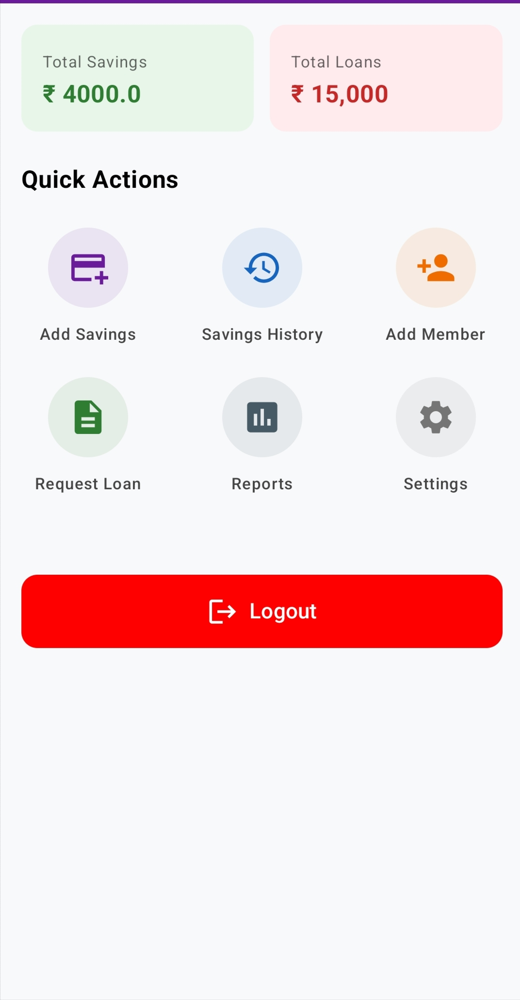
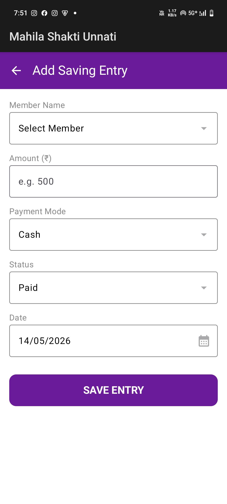
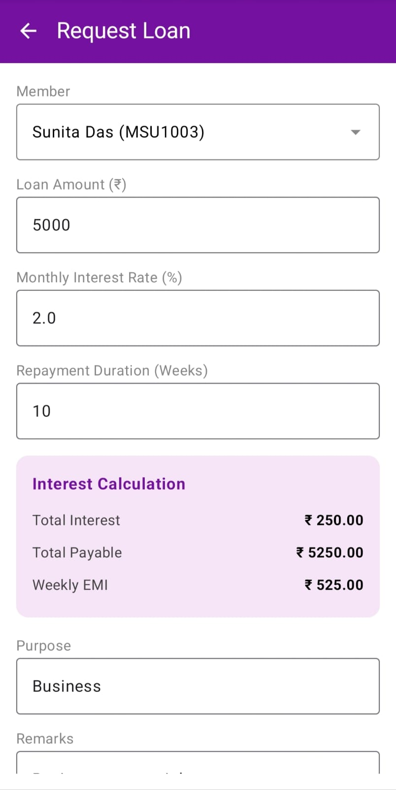

# Mahila Shakti Unnati 🌿

Empowering SHG groups with a bilingual digital ledger experience.

---

# 📖 Overview

Mahila Shakti Unnati is an Android application developed for Women's Self-Help Groups (SHGs).  
The application helps users digitally manage financial activities like savings, loans, and member records in a simple and efficient way.

It replaces traditional paper-based ledgers with a secure and user-friendly digital system.

---

# ✨ Features

- User Authentication
- Member Management
- Savings Tracking
- Loan Tracking
- Expense Reports
- Offline Data Storage
- Simple UI Design
- Multi-language Support

---

# 🛠️ Tech Stack

- Kotlin
- Jetpack Compose
- Android Studio
- SQLite Database

---

# 📱 Screenshots

## Dashboard

## Savings Tracker

## Loan Tracker

---

# 🚀 Future Enhancements

- Cloud Backup
- AI-based Financial Suggestions
- Advanced Reports
- SMS Notifications
- Online Sync Support

---

# 👨‍💻 Developer

Hema Pimpale
